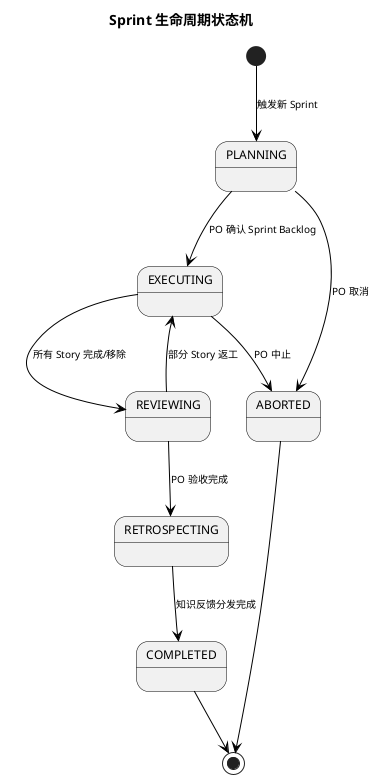

## Sprint 生命周期状态机

Flow Agent 驱动整个 Sprint 从 Refinement 到 Retrospective 的全流程。本文档定义 Sprint 级别的顶层状态机。

---

### 一、Sprint 状态定义

| 状态 | 英文标识 | 说明 | 允许停留最大时长 |
|:--|:--|:--|:--|
| 待规划 | PLANNING | Sprint Planning 进行中 | 2 个工作日 |
| 执行中 | EXECUTING | Sprint Execution 进行中 | Sprint 周期（通常 2 周） |
| 待评审 | REVIEWING | Sprint Review 进行中 | 1 个工作日 |
| 待回顾 | RETROSPECTING | Sprint Retrospective 进行中 | 1 个工作日 |
| 已完成 | COMPLETED | Sprint 正常结束 | 终态 |
| 已中止 | ABORTED | Sprint 被 PO 提前终止 | 终态 |

### 二、状态转换规则

```
[*] --> PLANNING : Flow Agent 触发新 Sprint

PLANNING --> EXECUTING : PO 确认 Sprint Backlog
PLANNING --> ABORTED : PO 决定取消 Sprint

EXECUTING --> REVIEWING : 所有 Story 到达"已部署"或"已移除"
EXECUTING --> ABORTED : PO 决定中止 Sprint

REVIEWING --> RETROSPECTING : PO 完成验收
REVIEWING --> EXECUTING : PO 要求返工（部分 Story 未通过验收）

RETROSPECTING --> COMPLETED : 知识反馈分发完成
COMPLETED --> [*]
ABORTED --> [*]
```

### 三、PlantUML 状态图



### 四、各状态下 Flow Agent 的职责

| Sprint 状态 | Flow Agent 动作 |
|:--|:--|
| PLANNING | 依次触发 SM Agent（容量评估）→ PO（选 Story）→ Arch Copilot（架构设计）→ SM Agent（任务拆分），每步等待完成后推进下一步 |
| EXECUTING | 按 Story 粒度驱动 Task 状态机（见 1.2），并行管理多个 Story 的流转 |
| REVIEWING | 触发 DevOps Agent 部署演示环境 → 通知 PO 验收 → 收集验收结果 |
| RETROSPECTING | 触发 SM Agent 生成回顾报告 → PO 确认改进项 → SM Agent 执行知识反馈分发 |
| ABORTED | 记录中止原因，未完成 Story 退回 Product Backlog，触发 SM Agent 生成中止报告 |
