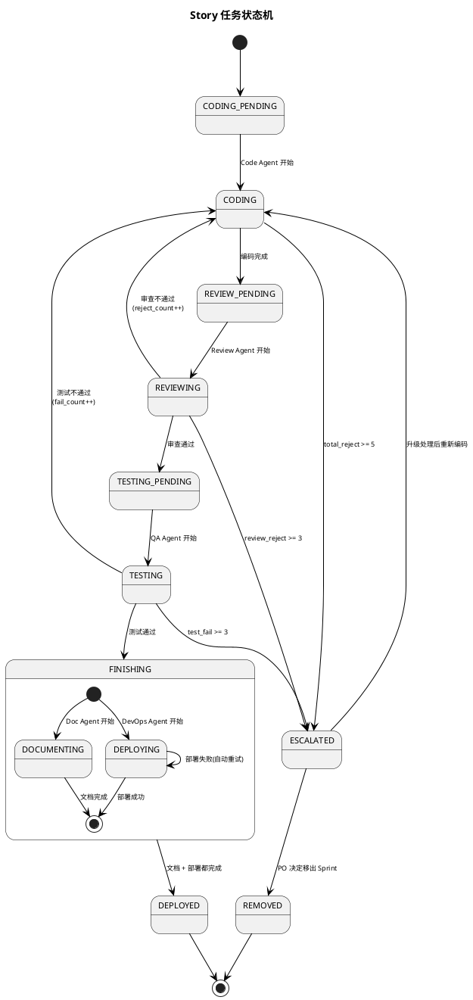

## Story 任务状态机

定义单个 Story 在 Sprint Execution 阶段的完整状态流转，包括正常路径、回退路径和熔断升级。

---

### 一、Story 状态定义

| 状态 | 英文标识 | 说明 |
|:--|:--|:--|
| 待编码 | CODING_PENDING | 已分配给 Code Agent，等待开始 |
| 编码中 | CODING | Code Agent 正在编码 + 单元测试 |
| 待审查 | REVIEW_PENDING | 代码提交，等待 Review Agent |
| 审查中 | REVIEWING | Review Agent 正在审查 |
| 待测试 | TESTING_PENDING | 审查通过，等待 QA Agent |
| 测试中 | TESTING | QA Agent 正在执行测试 |
| 待收尾 | FINISHING | 测试通过，并行触发 Doc Agent 和 DevOps Agent |
| 文档更新中 | DOCUMENTING | Doc Agent 正在更新文档（与部署并行） |
| 部署中 | DEPLOYING | DevOps Agent 正在部署（与文档并行） |
| 已部署 | DEPLOYED | 部署成功 + 文档完成，等待 Sprint Review 验收 |
| 已移除 | REMOVED | 从当前 Sprint 移除，退回 Backlog |
| 已熔断 | ESCALATED | 回退超限，升级处理中 |

### 二、正常流转路径

```
CODING_PENDING → CODING → REVIEW_PENDING → REVIEWING → TESTING_PENDING → TESTING → FINISHING
                                                                                     ├→ DOCUMENTING ─┐
                                                                                     └→ DEPLOYING ───┤→ DEPLOYED（两者都完成）
```

### 三、回退规则与回退工单

#### 3.1 回退触发条件

| 当前状态 | 触发条件 | 回退目标 |
|:--|:--|:--|
| REVIEWING | 代码审查不通过 | CODING |
| TESTING | 测试不通过 | CODING |
| DEPLOYING | 部署失败 | DEPLOY_PENDING（自动重试 1 次后人工介入） |

#### 3.2 回退工单规范

每次回退必须生成结构化的回退工单，禁止"打回去不说清楚为什么"：

```
回退工单编号：RJ-{story_id}-{seq}
回退来源：{REVIEWING / TESTING}
回退发起方：{Review Agent / QA Agent}
回退次数：第 {N} 次

问题分类（必选一项）：
  □ 需求理解偏差 — 实现与需求描述不一致
  □ 技术方案偏差 — 实现与架构设计不一致
  □ 编码逻辑错误 — 代码逻辑 bug
  □ 编码规范问题 — 命名/结构/注释不达标
  □ 安全漏洞     — 安全扫描发现问题
  □ 测试用例失败 — 功能不符合验收标准
  □ 性能不达标   — 响应时间/吞吐量不满足要求
  □ 环境/配置问题 — 非代码原因导致的失败

问题明细：
  | 序号 | 文件/用例 | 行号/步骤 | 问题描述 | 期望行为 | 修复建议 |
  |:--|:--|:--|:--|:--|:--|

关联上下文：
  - 相关需求条目：{user_story 验收标准编号}
  - 相关架构设计：{API/数据模型引用}
  - 上次回退工单：{RJ-xxx，如有}
```

#### 3.3 Code Agent 回退响应规范

Code Agent 收到回退工单后，必须输出修复报告：

```
修复报告编号：FX-{story_id}-{seq}
对应回退工单：RJ-{story_id}-{seq}

修复明细：
  | 序号 | 对应问题序号 | 修复方式 | 修改文件 | 修改说明 |
  |:--|:--|:--|:--|:--|

自检确认：
  □ 所有回退问题已逐项修复
  □ 修复未引入新问题（回归自测通过）
  □ 单元测试已补充/更新
  □ 上次回退的同类问题已排查（防止重复）
```

### 四、渐进式干预机制

不是等到熔断才处理，每次回退都有对应的干预动作，力度逐级递增。

#### 4.1 回退计数器

| 计数器 | 说明 |
|:--|:--|
| review_reject_count | 代码审查回退次数 |
| test_fail_count | 测试失败回退次数 |
| total_reject_count | 总回退次数（审查 + 测试） |

#### 4.2 渐进式干预阶梯

| 阶段 | 触发条件 | 干预动作 | 干预角色 |
|:--|:--|:--|:--|
| L0 正常 | 第 1 次回退 | 正常回退，Code Agent 按回退工单修复 | Code Agent |
| L1 关注 | 第 2 次回退（同一来源） | SM Agent 标记"关注"，在进度报告中高亮；Code Agent 修复时必须附带根因分析（为什么上次没修对） | Code Agent + SM Agent |
| L2 预警 | review_reject ≥ 2 或 test_fail ≥ 2 或 total ≥ 3 | SM Agent 预警 PO；SM Agent 分析回退工单历史，判断问题是否集中在同一类别；如果连续 2 次回退的问题分类相同，触发专项诊断 | SM Agent + PO |
| L3 诊断 | L2 专项诊断触发，或 total ≥ 4 | SM Agent 生成诊断报告，判定根因归属（需求/架构/编码/环境）；根据归属拉入对应角色介入（见下表） | SM Agent + 归属角色 |
| L4 熔断 | review_reject ≥ 3 或 test_fail ≥ 3 或 total ≥ 5 | Story 状态变为 ESCALATED，暂停正常流转，进入升级处理流程（见第五节） | PO 决策 |

#### 4.3 L3 诊断介入规则

| 诊断归属 | 介入角色 | 介入方式 | 产出 |
|:--|:--|:--|:--|
| 需求不清晰 | BA Copilot | 重新走场景引导法分析该 Story 涉及的场景细节，补充遗漏的业务规则 | 更新后的需求细节 + 验收标准 |
| 技术方案缺陷 | Arch Copilot | 重新评审该 Story 的技术方案，检查接口设计/数据模型是否合理 | 修订后的技术方案 + ADR |
| 编码质量问题 | Review Agent | 输出该 Story 所有回退问题的汇总分析，识别 Code Agent 的薄弱环节 | 编码改进建议（写入知识反馈） |
| 环境/配置问题 | DevOps Agent | 排查测试环境配置、依赖服务状态、数据一致性 | 环境修复报告 |

> L3 诊断不暂停 Story 流转，诊断结果出来后 Code Agent 带着补充信息继续修复。只有 L4 才暂停。

#### 4.4 回退模式识别

SM Agent 在 L2 阶段分析回退历史时，识别以下模式：

| 模式 | 特征 | 说明 | 建议动作 |
|:--|:--|:--|:--|
| 同类反复 | 连续 2+ 次回退的问题分类相同 | 说明根因未解决，修的是表面 | 触发 L3 诊断 |
| 交叉回退 | 审查通过 → 测试失败 → 修复 → 审查又不通过 | 修测试 bug 时引入了新的审查问题 | 要求 Code Agent 修复后先自查审查规则再提交 |
| 范围蔓延 | 每次回退后修改的文件数递增 | 说明改动影响范围在扩大，可能方案有问题 | 触发 L3 诊断（技术方案缺陷） |
| 需求漂移 | 回退工单中"需求理解偏差"出现 2+ 次 | 说明需求本身有歧义 | 直接触发 BA Copilot 介入，不等 L3 |

### 五、熔断升级路径

```
Story 触发熔断
     ↓
SM Agent（分析回退原因，生成诊断报告）
     ↓
诊断分类 ──→ 需求不清晰 ──→ 回退到 BA Copilot 重新澄清需求
         ├─→ 技术方案有缺陷 ──→ 回退到 Arch Copilot 重新评审方案
         ├─→ 编码质量问题 ──→ PO 决定：换人重做 / 结对编程 / 移出 Sprint
         └─→ 测试环境问题 ──→ DevOps Agent 排查环境，修复后重新进入测试
     ↓
PO 确认升级处理方案
     ↓
执行处理方案，Story 重新进入对应状态
```

诊断分类规则：

| 诊断依据 | 判定为 |
|:--|:--|
| 审查报告中多次出现"需求不明确"、"业务规则缺失" | 需求不清晰 |
| 审查报告中多次出现"架构不合理"、"接口设计有问题" | 技术方案有缺陷 |
| 审查报告中多次出现"代码规范"、"逻辑错误"、"单元测试缺失" | 编码质量问题 |
| 测试报告中出现"环境配置"、"依赖服务不可用"、"数据不一致" | 测试环境问题 |

### 六、并行 Story 管理

Flow Agent 同时管理多个 Story 的状态机实例：

| 场景 | 处理方式 |
|:--|:--|
| 多个 Story 同时处于 CODING | 并行执行，互不阻塞 |
| Story A 依赖 Story B | Story A 在 CODING_PENDING 等待，直到 Story B 到达 DEPLOYED |
| Doc Agent 并行触发 | 测试通过后，Doc Agent 和 DevOps Agent 同时触发，互不阻塞，两者都完成后 Story 进入 DEPLOYED |
| 某个 Story 熔断 | 不影响其他 Story 的正常流转 |
| Agent 排队 | 同一 Agent 有多个待处理任务时，按 Story 优先级排序执行 |

### 七、PlantUML 状态图


