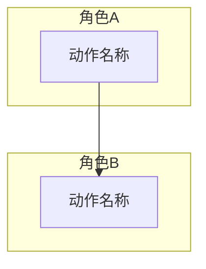

# 输出格式

## 流程清单

| 流程编号 | 流程名称 | 流程类型 | 涉及角色 | 简要说明 |
|---------|---------|---------|---------|---------|

流程类型：一般审批流程 / 简单流程 / CRUD 流程 / 子流程

## 流程详情

每个流程单独一节，包含：

### P-x：<流程名称>

- **类型**：一般审批流程 / 简单流程 / CRUD 流程 / 子流程
- **涉及角色**：角色 A、角色 B
- **前置条件**：触发该流程的条件
- **后置结果**：流程完成后的状态

**Mermaid 流程图：**

### 规则

- 一般审批流程按 预处理→申请→审批→执行开始→执行结束→后续处理 阶段组织
- CRUD 流程每个实体拆为创建、查看、更新、删除 4 个独立流程
- 多阶段流程拆分为独立流程，不合并
- 实际共享职责的角色可合并到同一分组
- Mermaid 代码必须语法正确，可直接渲染
- 不存在的流程类型不生成空条目
